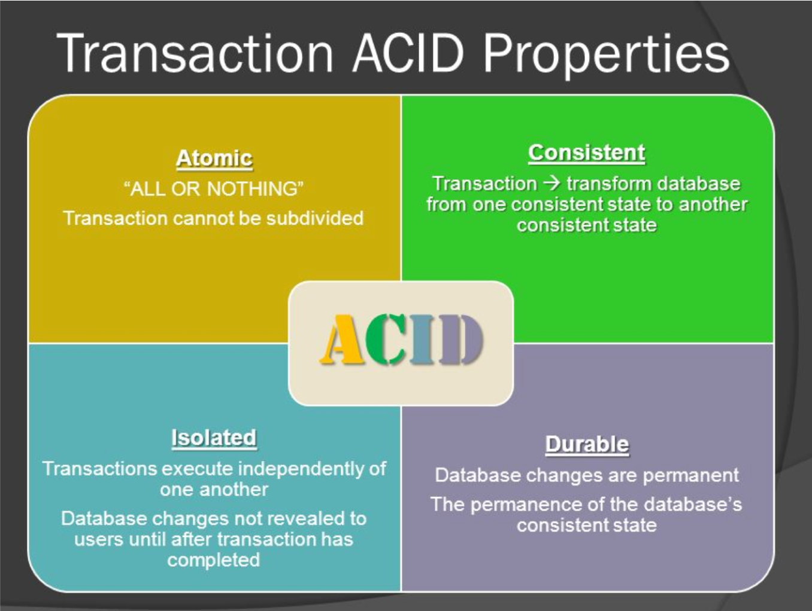
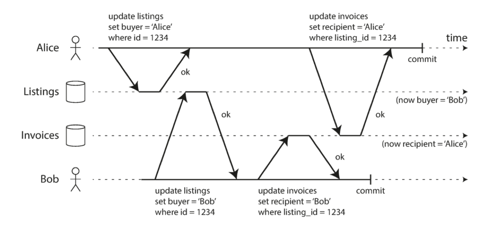
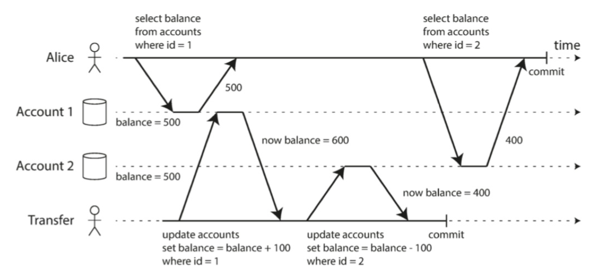
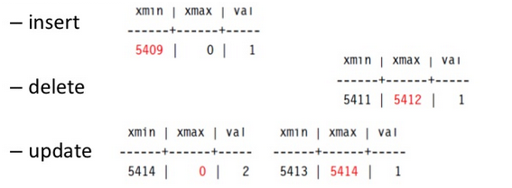
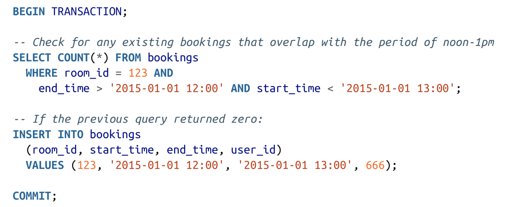
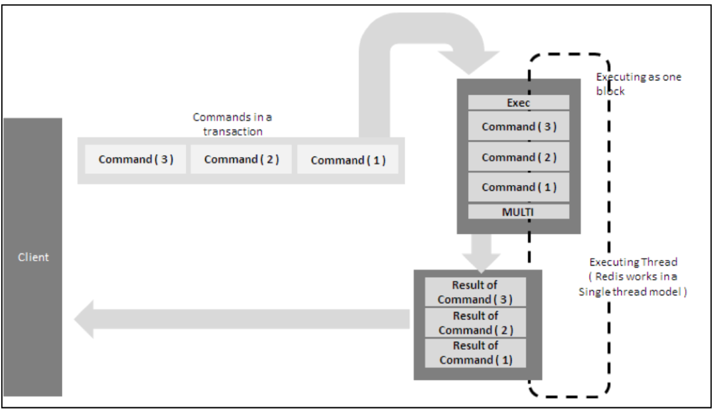
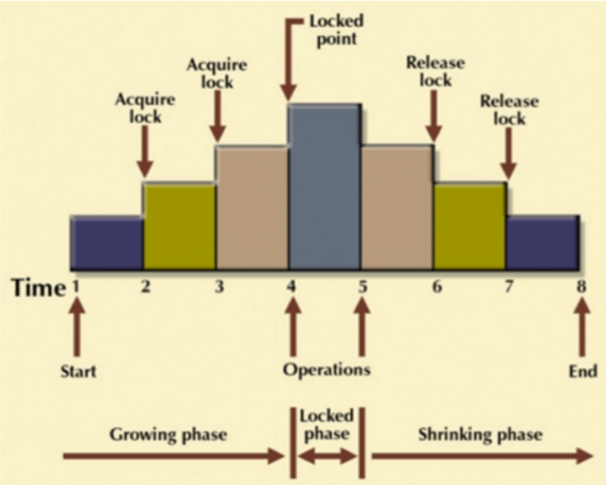
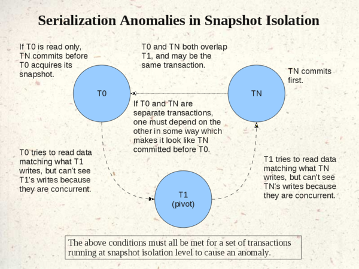

<!-- TOC -->
- [Transections](#transections)
	- [Keywords](#keywords)
	- [Questions](#questions)
	- [Notes](#notes)
		- [Transactions](#transactions)
		- [Single-Object and Multi-Object Operations](#single-object-and-multi-object-operations)
			- [Single-object writes](#single-object-writes)
			- [Multi-Object Operations](#multi-object-operations)
		- [Weak isolation levels](#weak-isolation-levels)
			- [Read committed](#read-committed)
			- [Snapshot isolation](#snapshot-isolation)
		- [Serialization](#serialization)
			- [Actual Serial Execution](#actual-serial-execution)
			- [Pessimistic Lock/Optimistic Lock](#pessimistic-lockoptimistic-lock)
	- [Reference](#reference)

# Transections

## Keywords

## Questions

## Notes

### Transactions
- Transactions provide guarantees about the behavior of data that are fundamental to the old SQL style of operation.
- Transactions were the initial casualty of the NoSQL movement, though they are starting to make a bit of a comeback.
- **Not all applications need transactions. Not all applications want transactions. And not all transactions are the same.**

  
 

### Single-Object and Multi-Object Operations

#### Single-object writes
Atomicity can be implemented using a log for crash recovery and isolation can be implemented using a lock on each object (allowing only one thread to access an object at any one time).  

#### Multi-Object Operations
Foreign key referernce update/Second level index  
Nosql update several document togehter  

### Weak isolation levels

The strongest possible isolation guarantee is serializable isolation: transactions that run concurrently on the same data are guaranteed to perform the same as they would were they to run serially.  However serializable isolation is costly. Systems skimp on it by offering weaker forms of isolation.  As a result, race conditions and failure modes abound. Concurrent failures are really, really hard to debug, because they require lucky timings in your system to occur.

#### Read committed
- The weakest isolation guarantee is read committed.   
  When reading from the database, you will only see data that has been committed (no dirty reads).  
  When writing to the database, you will only overwrite data that has been committed (no dirty writes).  
- This isolation level prevents dirty reads (reads of data that is in-flight) and dirty writes (writes over data that is in-flight).
- Lack of dirty read safety would allow you to read values that then get rolled back. Lack of dirty write safety would allow you to write values that read to something else in-flight (so e.g. the wrong person could get an invoice for a product that they didn't actually get to buy).  

- Read committed does not prevent **the race condition between two counter increments**.

  
 
- Implemetation 
  **Hold a row-level lock** on the record you are writing to.  You could do the same with a read lock. However, there is a lower-impact way. Hold the old value in memory, and issue that value in response to reads, until the transaction is finalized.  If a user performs a multi-object write transaction that they believe to be atomic (say, transferring money between two accounts), then performs a read in between the transaction, what they see may seem anomalous (say, one account was deducted but the other wasn't credited).

#### Snapshot isolation

  
 
Snapshot isolation could address issue of read committed.  Reads that occur in the middle of a transaction read their data from the version of the data (the snapshot) that preceded the start of the transaction.  This makes it so that multi-object operations look atomic to the end user (assuming they succeed).

- Implemetation   
  Using write locks and extended read value-holding (sometimes called "multiversion").  A key principle of snapshot isolation is **readers never block writers, and writers never block readers.**  
   
  * MVCC  
  	* [How MVCC work in postgresql](https://vladmihalcea.com/how-does-mvcc-multi-version-concurrency-control-work/)  
  	* [MVCC in Transactional Systems](https://0x0fff.com/mvcc-in-transactional-systems/)
  		* xmin - which defines the transaction id that inserted the record
  		* xmax - which defines the transaction id that deleted the row
  
		     
			* When you insert data, you insert the row with xmin equal to current transaction id and xmax set to null;  
			* When you delete the data, you find visible row that should be deleted, and set its xmax to the current transaction id  
			* When you update the data, for each updated row you first perform “delete” and then “insert”.  

- Possible issue: lost updates. Concurrent transactions that encapsulate read-modify-write operations will behave poorly on collision. A simple example is a counter that gets updated twice, but only goes up by one. The earlier write operation is said to be lost.  
  Ways to address this problem that live in the wild:
  - Atomic update operation (e.g. UPDATE keyword).
  - Transaction-wide write locking. Expensive!
  - Automatically detecting lost updates at the database level, and bubbling this back up to the application.
  - Atomic compare-and-set (e.g. UPDATE ... SET ... WHERE foo = 'expected_old_value').
  - Delayed application-based conflict resolution. Last resort, and only truly necessary for multi-master architectures.
- Possible issue: write skew    
     
  - As with lost updates, two transactions perform a read-modify-write, but now they modify two different objects based on the value they read.  
  - Example in the book: two doctors concurrently withdraw from being on-call, when business logic dictates that at least one must always be on call.  This occurs across multiple objects, so atomic operations do not help.   
  - Automatic detection at the snapshot isolation level and without serializability would require making consistency checks on every write, where is the number of concurrent write-carrying transactions in flight. This is way too high a performance penalty. 
  - Only transaction-wide record locking works. So you have to make this transaction explicitly serialized, using e.g. a FOR UPDATE keyword. 

- Next possible grade of issue: phantom write skew.
  - Materializing conflicts
  - You can theoretically insert a lock on a phantom record, and then stop the second transaction by noting the presence of the lock. This is known as materializing conflicts.  This is ugly because it messes with the application data model, however. Has limited support.  If this issue cannot be mitigated some other way, just give up and go serialized.

### Serialization

#### Actual Serial Execution
- The most literal way is to run transactions on a single CPU in a single thread. This is actual serialization.
- This only became a real possible recently, with the speed-ups of CPUs and the increasing size of RAM. The bottleneck is obviously really low here. But it's looking tenable. Systems that use literal serialization are of a post-2007 vintage.  However, this requires writing application code in a very different way.  
- This method mplemeted in Redis([transactions-redis](https://hub.packtpub.com/transactions-redis/))  
  
 

#### Pessimistic Lock/Optimistic Lock

Name | Details | Pros | Cons | Comments
---|:---|:---|:---|:---
Two-phase locking | * Transactions that read acquire shared-mode locks on touched records.   * Transactions that write acquire, and transactions that want to write after reading update to, exclusive locks on touched records.  * Transactions hold the highest grade locks they have for as long as the transaction is in play. | * Reads do not block reads or writes, but writes block everything.(Compre snapshot isolation, reads do not block reads or writes and writes do not block reads) | * Because so many locks occur, it's much easier than in snapshot isolation to arrive at a deadlock. Deadlocks occur when a transaction holds a lock on a record that another transaction needs, and that record holds a lock that the other transaction needs. The database has to automatically fail one of the transactions, roll it back, and prompt the application for a retry.   * It has very bad performance implications. Long-blocking writes are a problem. Deadlocks are a disaster. Generally 2PL architectures have very bad performance at high percentiles; this is a main reason why "want-to-be sleek" systems like Amazon have moved away from them. | 
Serializable snapshot isolation | * based on snapshot isolation, but adds an additional algorithmic layer that makes it serialized and isolated. | * Beats 2PL for certain workloads especially read-heavy workloads   * better performance when there is low record competition and when overall load is low| Poorer performance when lock competition is high and overall load is high. |

- 2 Phase Lock  
  
 

- SSI ([Postgis Serializable](https://wiki.postgresql.org/wiki/Serializable))  

  
 
- How to avoid dead lock in 2PL(a separate thread checking)  

[CMU Concurrancy control](https://15721.courses.cs.cmu.edu/spring2017/slides/03-cc.pdf)  

- How 2PL addresses phantom skew(implementation detail)  
You can evade phantom skew by using predicate locks. These lock on all data in the database that matches a certain condition, even data that doesn't exist yet.  Predicate locks are expensive because they involve a lot of compare operations, one for each concurrent write. In practice most databases use index-range locks instead, which simplify the predicate to an index of values of some kind instead of a complex condition.  This lock covers a strict superset of the records covered by the predicate lock, so it causes more queries to have to wait for lock releases. But, it spares CPU cycles, which is currently worth it.  

- **SSI is an optimistic concurrency control technique. Two-phase locking is a pessimistic concurrency control technique.**  SSI works by allowing potentially conflicting operations to go through, then making sure that nothing bad happens; 2PL works by preventing potentially conflicting operations from occurring at all.
- SSI detects, at commit time (e.g. at the end of the transaction), whether or not any of the operations (reads or writes) that the transaction is performing are based on outdated premises (values that have changed since the beginning of the transaction). If not, the transaction goes through. If yes, then the transaction fails and a retry is prompted.

## Reference
- [postgresql transaction iso](https://www.postgresql.org/docs/9.5/transaction-iso.html)
- [postgresql high performance tips](https://vladmihalcea.com/9-postgresql-high-performance-performance-tips/)