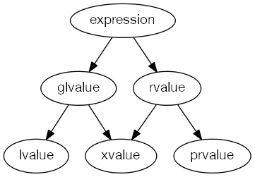

<!-- TOC -->
- [C++11 Notes](#c11-notes)
  - [General](#general)
  - [Key words](#key-words)
  - [Lvalue & Rvalue](#lvalue--rvalue)
  - [Lambda](#lambda)
  - [Concurrency](#concurrency)
    - [Implement go's keyword using C++](#implement-gos-keyword-using-c)
    - [Implementation of Thread Pool](#implementation-of-thread-pool)


# C++11 Notes

## General
[The biggest changes in C++11]( https://blog.smartbear.com/c-plus-plus/the-biggest-changes-in-c11-and-why-you-should-care/)  
[A glimpse into C++14]( https://blog.smartbear.com/development/a-glimpse-into-c14/)  

## Key words


| Keyword                       | Notes                          | Reference |
|-------------------------------|:------------------------------:|------------------------------:|
|default & delete||[code snippet](cpp.sh/542vn)|
|Std::unordered_multimap||[code snippet]( http://cpp.sh/7bxf5)|
|std::copy_if||[code snippet](http://cpp.sh/8tre)|
|std::adjacent_find|check the two element which is near to each other|[code snippet]( http://cpp.sh/4h2a4)|
|std::nth_element ||[cppreference]( http://en.cppreference.com/w/cpp/algorithm/nth_element) [code snippet](http://cpp.sh/3axpc) |
|Std::find_if|| [code snippet](http://cpp.sh/7jh47)|


## Lvalue & Rvalue
 



| Keyword                       | Notes                          | Reference |
|-------------------------------|:------------------------------|:------------------------------|
|| * Whether it’s a lvalue or rvalue : Can you get the address <br/>* lvalue - An object that occupies some identifiable location in memory<br/> * rvalue - Any object that is not a lvalue <br/>* 1. Every C++ expression yield either an rvalue or a lvalue. <br/>* 2. If the expression has an identifiable memory address, it's lvalue; otherwise, rvalue.|[code snippet](http://cpp.sh/9oz7) <br/> [cppreference]( http://en.cppreference.com/mwiki/index.php?title=cpp/language/value_category&oldid=85137) <br/> [Stroustrup - To move or not to move](http://www.stroustrup.com/move.pdf) <br/> [Scott Meyers - Cppcon - Type Deduction and Why You Care](https://github.com/CppCon/CppCon2014/tree/master/Presentations/Type%20Deduction%20and%20Why%20You%20Care) <br/><br/>[C++11 Tutorial: Explaining the Ever-Elusive Lvalues and Rvalues](https://blog.smartbear.com/development/c11-tutorial-explaining-the-ever-elusive-lvalues-and-rvalues/) <br/>[blog - move statement and perfect forward](https://codinfox.github.io/dev/2014/06/03/move-semantic-perfect-forward) <br/> [Understanding lvalues and rvalues in C and C++](https://eli.thegreenplace.net/2011/12/15/understanding-lvalues-and-rvalues-in-c-and-c) <br/> <br/> [stackoverflow - why stdmove and when should it be used for](https://stackoverflow.com/questions/3413470/what-is-stdmove-and-when-should-it-be-used?rq=1) <br/> [stackoverflow - What are rvalues, lvalues, xvalues, glvalues, and prvalues? ](https://stackoverflow.com/questions/3601602/what-are-rvalues-lvalues-xvalues-glvalues-and-prvalues) <br/>[stackoverflow  - What does T&& (double ampersand) mean in C++11?](https://stackoverflow.com/questions/5481539/what-does-t-double-ampersand-mean-in-c11)|


## Lambda
Grammer
```
[capture clause] (parameters) -> return-type {body}
```
| Keyword                       | Notes                          | Reference |
|-------------------------------|:------------------------------|:------------------------------|
||[=] //capture all of the variables from the enclosing scope by value<br/>[&]//capture all of the variables from the enclosing scope by reference <br/>[this]//capture all of the data members of the enclosing class<br/>  // lamda help to pass context <br/>[this] pass by reference <br/>[*this] pass by copy |[code snippet]( http://cpp.sh/4kofdf) <br/> [cppreference]( http://en.cppreference.com/w/cpp/language/lambda) <br/>  [C++11 tutorial lambda expressions the nuts and bolts of functional programming]( https://smartbear.com/blog/develop/c11-tutorial-lambda-expressions-the-nuts-and-bolts/) <br/> [Glennan Carnie - Demystifying C++ lambdas]( https://blog.feabhas.com/2014/03/demystifying-c-lambdas/) <br/> [University of Michigan - Handout - Using C++ Lambdas](http://umich.edu/~eecs381/handouts/Lambda.pdf)| <br/>


## Concurrency

| Keyword                       | Notes                          | Reference |
|-------------------------------|:------------------------------|:------------------------------|
|Lock_guard||[code snippet](http://cpp.sh/6y3fi)|
|Detach||[code snippet](http://cpp.sh/8zb43)|
|condition_variable||[code snippet](http://cpp.sh/8vxt)|
|Promise&Future| std::promise is used by the "producer/writer" of the asynchronous operation. <br/>std::future is used by the "consumer/reader" of the asynchronous operation. |[code snippet](http://cpp.sh/4kr) <br/>[code snippet](http://cpp.sh/7gbd7)<br/> [code snippet](http://cpp.sh/865jm) <br/> [cppreference](http://en.cppreference.com/w/cpp/thread/promise/set_value) <br/><br/> [Concurrency in C++11 - promise, future and what's next](https://paoloseverini.wordpress.com/2014/04/07/concurrency-in-c11/) <br/> [Futures from Scratch]( https://github.com/CppCon/CppCon2015/blob/master/Tutorials/Futures%20from%20Scratch/Futures%20from%20Scratch%20-%20Arthur%20O'Dwyer%20-%20CppCon%202015.pdf) [vedio](https://www.youtube.com/watch?v=jfDRgnxDe7o&t=1031s) <br/> <br/> [github - twitter - promise impl in scala](https://github.com/twitter/util/blob/master/util-core/src/main/scala/com/twitter/util/Promise.scala) <br/> [github - twitter future impl in scala](https://github.com/twitter/util/blob/master/util-core/src/main/scala/com/twitter/util/Future.scala) <br/> [github - twiter - finagle futures](https://twitter.github.io/finagle/guide/Futures.html)|


### Implement go's keyword using C++

[github - slab - implementation of Future and channel ](https://github.com/stlab/libraries)  
[github - libgo - 魅族科技](https://github.com/yyzybb537/libgo)


### Implementation of Thread Pool
[github - simple C++11 thread pool impl](https://github.com/progschj/ThreadPool)  
[github - thread-pool doc](https://github.com/mtrebi/thread-pool/blob/master/README.md#thread-pool)

