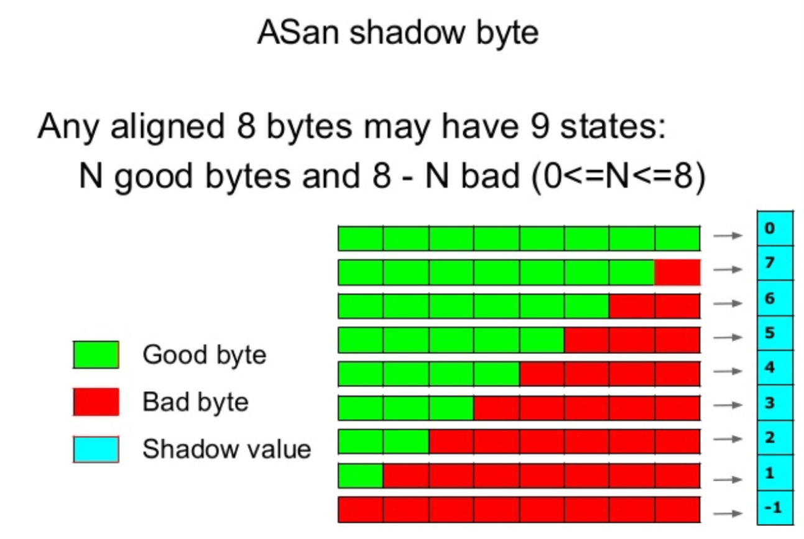
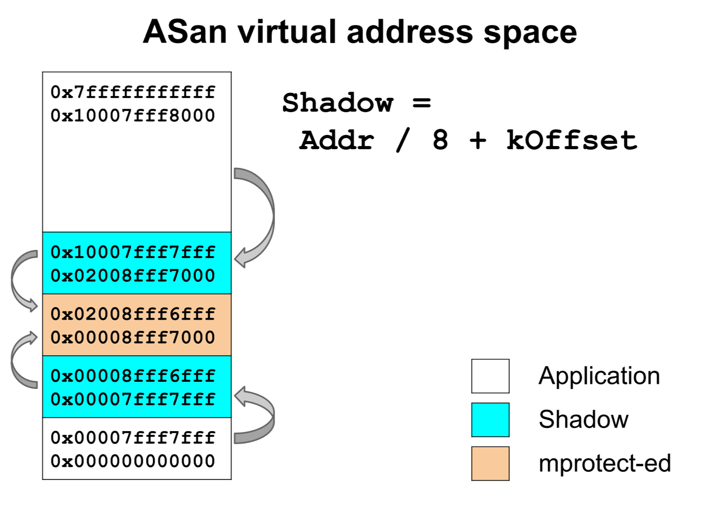

# C++ tools

This page list a bouch of tools which helps me to find C++ related issues.  Most of them identify issues at **running time**, which means **the more scenarios your test could cover, the more benifits you could get from those tools**.

## Address Sanitizer
### Problem set
- Out of boundary.  Overflow is *the* most issue happend in my previous bug trace experice.  No matter with what kind of tool, I will suggest once you use operator [] on array or vector please pay more attention for whether the index is in the valid range.  <br/>
```C++
int array[100] = {0};
//...
    array[x + 100] = 1;
```
No matter this array is allocated in heap or stack or static data, -fsanitizer=address could help to detect it.

Actually, **iterators** are for such situation.  When you find certain ranges be frequently used, take a deeper think whether you could abstract them


- Use after free
```C++
int * p = new int[100];
delete[] p;
// ...
p[index] = value;
```
-fsanitizer=address could help to identify it


- Memory leak/double free
-fsanitizer=address could help to detect it.  Or, **any place use new/delete directly, consider the reason for not using sharedptr**

- stack_use_after_return

```C++
int *g;
void func1()
{
    int temp = 0;
    g = &temp;
}

void func2()
{
    func1();
    *g = 3;
}

```
Use `ASAN_OPTIONS=detect_stack_use_after_return=1` while running excutable could hel to detect it. <br/>
Please do distiguish upper case with follow one
```C++
std::vector<int> func()
{
    std::vector<int> vTemp = {0};
    return vTemp;
}

auto v = func();
// use v
```
The use of v is safe after C++11 due the std::move's support for all STL containers.

### Intenal
Inorder to know the status of memory usage, AS replace compiler's malloc and add poinson bits to detect errors. <br/>
It use shadow memory to record whether each byte of application memory is safe to access, and use istrumentation to check the shadow memory on each application load or store.  

#### shadow memory

Compare to Valgrind, AS use a more compact shadow encoding and more efficient shadow mapping.  <br/>


AddressSanitizer dedicates one-eighth of the virtual address space to its shadow memory and uses a direct mapping with a scale and offset to translate an application address to its corresponding shadow address.  

The value of Offset should be chosen in a way that the region from Offset to Offset+Max/8 is not occupied at startup.  On a 64-bit system with 47 significant address bits we use Offset =`0x0000100000000000` (244).


#### Instrumentation

```C++
*a = ...

char *shadow = (a >>3) + offset

// 8 bytes access
if (*shadow)
    ReportError(a)

// N bytes access N=1,2,4
// AS assum random bytes read is aligned to N
if (*shadow && *shadow <= ((a&7) + N -1))
    ReportError(a)

```
Instrumentation inserts only one memory read for each memory access in the original code.

#### Run-time Library


### Impact
2x slowdown, 1.5x ~ 3x memory overhead


## Thread Sanitizer


## Memory Sanitizer


### Problem set

MS detects uninitialized memory reads

```C++
int main(int argc, char **argv) {
    int x[10];
    x[0] = 1;
    return x[argc];
}
```

### Intenal
Similar to AS, using shadow memory.


## stacktrace


## gprofie


# Reference
- [github/google/AddressSanitizer wiki](https://github.com/google/sanitizers/wiki/AddressSanitizer)<br/>
- [slideshare - Address/Thread/Memory Sanitizer](https://www.slideshare.net/sermp/sanitizer-cppcon-russia)<br/>
- [Paper - AddressSanitizer: A Fast Address Sanity Checker](https://www.usenix.org/system/files/conference/atc12/atc12-final39.pdf)<br/>
