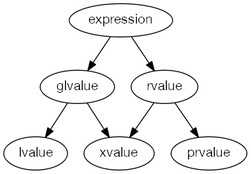

<!-- TOC -->
- [C++11 Notes](#c11-notes)
  - [General](#general)
  - [Lvalue & Rvalue](#lvalue--rvalue)
  - [Lambda](#lambda)
  - [Sharedptr](#sharedptr)
  - [Key words](#key-words)
  - [Concurrency](#concurrency)
    - [Implementation of go's keyword using C++](#implementation-of-gos-keyword-using-c)
    - [Implementation of Thread Pool](#implementation-of-thread-pool)
    - [Implementation of simple TBB](#implementation-of-simple-tbb)


# C++11 Notes

## General
[The biggest changes in C++11](https://smartbear.com/blog/develop/the-biggest-changes-in-c11-and-why-you-should-care/)  
[A glimpse into C++14]( https://blog.smartbear.com/development/a-glimpse-into-c14/)  


## Lvalue & Rvalue
 



| Keyword                       | Notes                          | Reference |
|-------------------------------|:------------------------------|:------------------------------|
|| * lvalue or rvalue : Can you get the address <br/> * The most useful place for rvalue reference is overloading copy constructor and assignment operator, to achieve move semantics.<br/>* lvalue - An object that occupies some identifiable location in memory<br/> * rvalue - Any object that is not a lvalue <br/>* 1. Every C++ expression yield either an rvalue or a lvalue. <br/>* 2. If the expression has an identifiable memory address, it's lvalue; otherwise, rvalue.|* [code snippet](http://cpp.sh/9oz7) <br/> * [cppreference]( http://en.cppreference.com/mwiki/index.php?title=cpp/language/value_category&oldid=85137) <br/> * [Stroustrup - To move or not to move](http://www.stroustrup.com/move.pdf) <br/> * [Scott Meyers - Cppcon - Type Deduction and Why You Care](https://github.com/CppCon/CppCon2014/tree/master/Presentations/Type%20Deduction%20and%20Why%20You%20Care) [video](https://www.youtube.com/watch?v=wQxj20X-tIU) <br/><br/> * [C++11 Tutorial: Explaining the Ever-Elusive Lvalues and Rvalues](https://blog.smartbear.com/development/c11-tutorial-explaining-the-ever-elusive-lvalues-and-rvalues/) <br/> * [blog - move statement and perfect forward](https://codinfox.github.io/dev/2014/06/03/move-semantic-perfect-forward) <br/> * [Understanding lvalues and rvalues in C and C++](https://eli.thegreenplace.net/2011/12/15/understanding-lvalues-and-rvalues-in-c-and-c) <br/> <br/> * [stackoverflow - why stdmove and when should it be used for](https://stackoverflow.com/questions/3413470/what-is-stdmove-and-when-should-it-be-used?rq=1) <br/> * [stackoverflow - What are rvalues, lvalues, xvalues, glvalues, and prvalues? ](https://stackoverflow.com/questions/3601602/what-are-rvalues-lvalues-xvalues-glvalues-and-prvalues) <br/>* [stackoverflow  - What does T&& (double ampersand) mean in C++11?](https://stackoverflow.com/questions/5481539/what-does-t-double-ampersand-mean-in-c11)|

- Move constructor is particularly powerful where passing by reference and passing by value are both needed.  
Move constructor give you finer control of which part of your object to be moved.
```C++
boVector(const boVector && rhs) {
    cout << "Move constructor.\n";
    size = rhs.size;
    array = rhs.array;
    overload(rhs);
   }

   overload(boVector&  v) { cout << "by lvalue."; }
   overload(boVector&& v) { cout << "by rvalue."; }
```

- Why need std::forward
```C++
//一个右值引用作为函数的形参，在函数内部再转发的时候已经变成一个左值了

Template <typename T> void forwardValue(T& val) { processValue(val);} // change to left value

Template <typename T> void forwardValue(const T& value) {processValue(val);} // change to const ref to left

```


## Lambda
Grammer
```
[capture clause] (parameters) -> return-type {body}
```
| Keyword                       | Notes                          | Reference |
|-------------------------------|:------------------------------|:------------------------------|
||[=] //capture all of the variables from the enclosing scope by value<br/>[&]//capture all of the variables from the enclosing scope by reference <br/>[this]//capture all of the data members of the enclosing class<br/>  // lamda help to pass context <br/>[this] pass by reference <br/>[*this] pass by copy |[code snippet](http://cpp.sh/4kofdf) <br/> [cppreference]( http://en.cppreference.com/w/cpp/language/lambda) <br/>  [C++11 tutorial lambda expressions the nuts and bolts of functional programming]( https://smartbear.com/blog/develop/c11-tutorial-lambda-expressions-the-nuts-and-bolts/) <br/> [Glennan Carnie - Demystifying C++ lambdas]( https://blog.feabhas.com/2014/03/demystifying-c-lambdas/) <br/> [University of Michigan - Handout - Using C++ Lambdas](http://umich.edu/~eecs381/handouts/Lambda.pdf) <br/>|
|std::bind||[code snippet](http://cpp.sh/6urbc)| 
|Std::function|const std::function<void(int)>& f|[code snippet](http://cpp.sh/6bcdz)|


## Sharedptr
| Keyword                       | Notes                          | Reference |
|-------------------------------|:------------------------------|:------------------------------|
|shared_ptr|||
|unique_ptr|guarantee deallocation||
|weak_ptr|||
<br/>

- Example of unique_ptr [from aws-sdk](https://github.com/aws/aws-iot-device-sdk-cpp/blob/dab39e33abad342e51476cde85d35613159203c5/src/util/JsonParser.cpp#L40)
```C++
std::unique_ptr<FILE, int (*)(FILE *)>
input_file = std::unique_ptr<FILE, int (*)(FILE *)>(fopen(input_file_path.c_str(), "rb"), fclose);
if (nullptr == input_file) {
    return ResponseCode::FILE_OPEN_ERROR;
}
```

- Example of unique_ptr [from aws-sdk](https://github.com/aws/aws-iot-device-sdk-cpp/blob/dab39e33abad342e51476cde85d35613159203c5/src/util/JsonParser.cpp#L53)

```C++
std::unique_ptr<char[]> read_buffer = std::unique_ptr<char[]>(new char[fsize]);
```

- std::unique_ptr 指定删除器的时候需要确定删除器的类型
```C++
std::shared_ptr<int> ptr(new int(1),[](int* p){delete p}); //correct
 std::unique_ptr<int> ptr(new int(1),[](int* p){delete p}); //incorrect!

std::unique_ptr<int,void(*)(int*)> ptr(new int(1),[](int* p){delete p;}); //correct
std::unique_ptr<int,void(*)(int*)> ptr(new int(1),[&](int* p){delete p;}); //incorrect, capture variable

std::unique_ptr<int,std::function<void(int*)>> ptr(new int(1),[&](int* p){delete p;});
```

- **Never dereferernce shared_ptr and then call obejct's interface**
```C++
auto& p = *returns_a_shard_ptr();
// If you dereference shared_ptr to normal pointers, that means you given up protection from shared_ptr
// When reference count of this shared_ptr becomes 0, the resource it holds will be destructed
// Call interface from p is very dengerous and could possibly caused crash
p.func();  
```


## Key words


| Keyword                       | Notes                          | Reference |
|-------------------------------|:------------------------------|------------------------------:|
|default & delete||[code snippet](http://cpp.sh/542vn)|
|std::initializer_list||[code snippet](http://cpp.sh/6zfao)|
|Std::unordered_multimap||[code snippet]( http://cpp.sh/7bxf5)|
|std::copy_if||[code snippet](http://cpp.sh/8tre)|
|std::adjacent_find|check the two element which is near to each other|[code snippet]( http://cpp.sh/4h2a4)|
|std::nth_element ||[cppreference]( http://en.cppreference.com/w/cpp/algorithm/nth_element) [code snippet](http://cpp.sh/3axpc) |
|Std::find_if|| [code snippet](http://cpp.sh/7jh47)|
|Std::decay|Remove reference and const volatile(cv) |[example in OSRM](https://github.com/Project-OSRM/osrm-backend/blob/82b5648c97edf1d2edec7aecebc35aa8a8033c82/src/server/api/url_parser.cpp#L74)|
|Std::result_of|Obtain the result type of a call to fn <br/>拿一个可调用对象的返回值类型|[code snippet](http://cpp.sh/85qkt)|


## Concurrency

| Keyword                       | Notes                          | Reference |
|-------------------------------|:------------------------------|:------------------------------|
|Lock_guard||[code snippet](http://cpp.sh/6y3fi)|
|Detach||[code snippet](http://cpp.sh/8zb43)|
|condition_variable||[code snippet](http://cpp.sh/8vxt)|
|Promise&Future| std::promise is used by the "producer/writer" of the asynchronous operation. <br/>std::future is used by the "consumer/reader" of the asynchronous operation. |[code snippet](http://cpp.sh/4kr) <br/>[code snippet](http://cpp.sh/7gbd7)<br/> [code snippet](http://cpp.sh/865jm) <br/> [cppreference](http://en.cppreference.com/w/cpp/thread/promise/set_value) <br/><br/> [Concurrency in C++11 - promise, future and what's next](https://paoloseverini.wordpress.com/2014/04/07/concurrency-in-c11/) <br/> [Futures from Scratch]( https://github.com/CppCon/CppCon2015/blob/master/Tutorials/Futures%20from%20Scratch/Futures%20from%20Scratch%20-%20Arthur%20O'Dwyer%20-%20CppCon%202015.pdf) [video](https://www.youtube.com/watch?v=jfDRgnxDe7o&t=1031s) <br/> <br/> [github - twitter - promise impl in scala](https://github.com/twitter/util/blob/master/util-core/src/main/scala/com/twitter/util/Promise.scala) <br/> [github - twitter future impl in scala](https://github.com/twitter/util/blob/master/util-core/src/main/scala/com/twitter/util/Future.scala) <br/> [github - twiter - finagle futures](https://twitter.github.io/finagle/guide/Futures.html)|


### Implementation of go's keyword using C++

[github - slab - implementation of Future and channel ](https://github.com/stlab/libraries)  
[github - libgo - 魅族科技](https://github.com/yyzybb537/libgo)


### Implementation of Thread Pool
[github - simple C++11 thread pool impl](https://github.com/progschj/ThreadPool)  
[github - thread-pool doc](https://github.com/mtrebi/thread-pool/blob/master/README.md#thread-pool)

### Implementation of simple TBB
[github - task impl](https://github.com/CodeBear801/zoo/blob/eee7b107f3e3909c837538b60aa691aa78eba15f/concurrency/tbb_simple/include/task.hpp#L43)  
[github - ParallelForeach impl](https://github.com/CodeBear801/zoo/blob/eee7b107f3e3909c837538b60aa691aa78eba15f/concurrency/tbb_simple/include/parallel_algrithm.hpp#L11)

