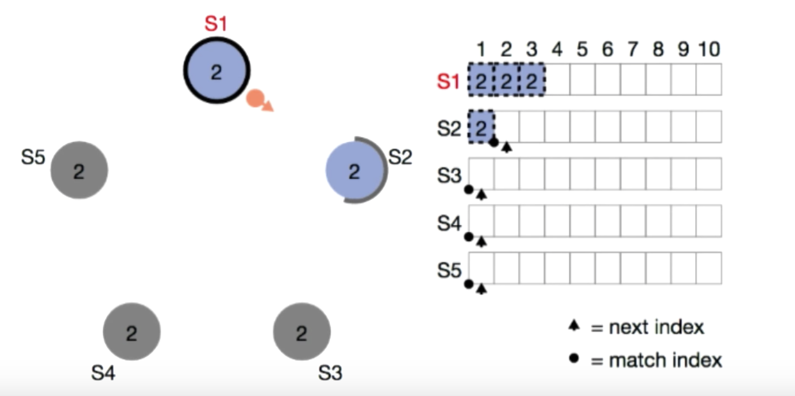
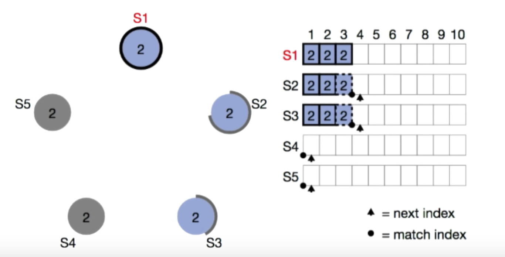
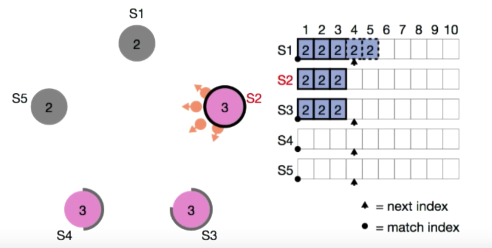
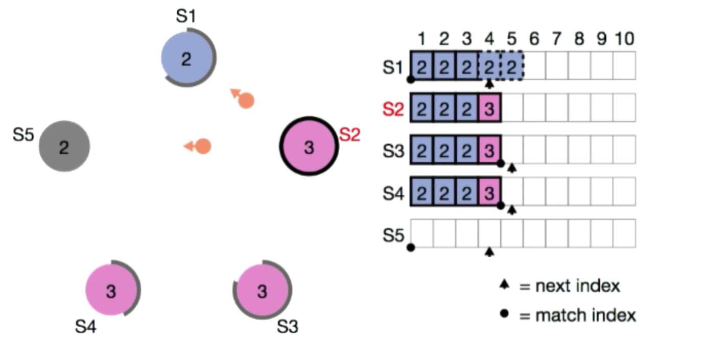
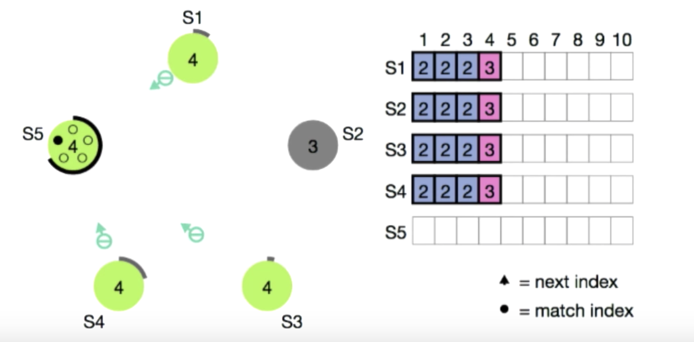
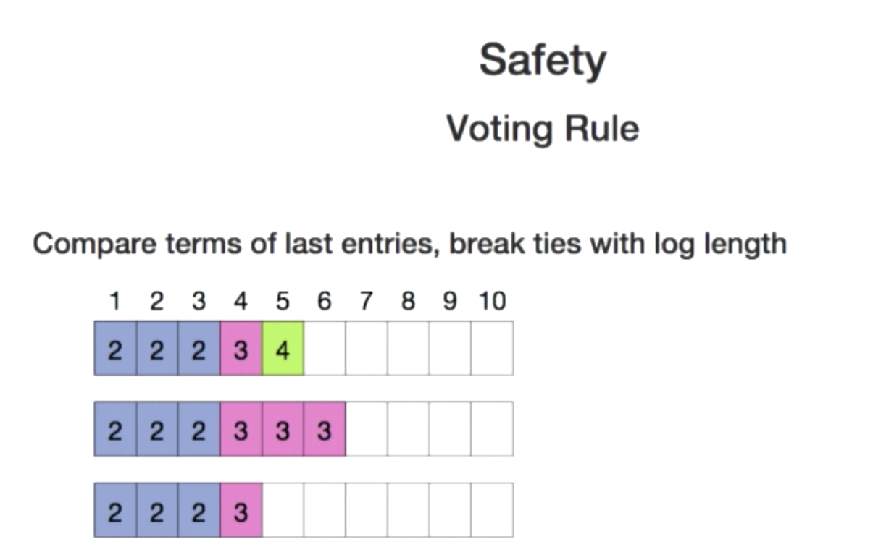
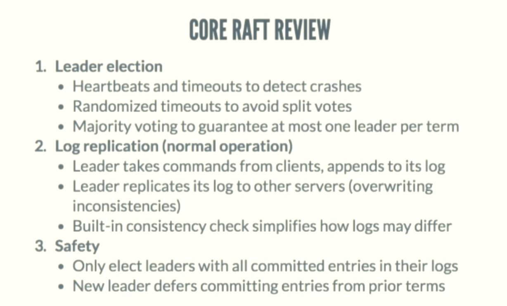

# Raft

## Presentation of Deigo
[An Introduction to Raft (CoreOS Fest 2015)](https://www.youtube.com/watch?v=6bBggO6KN_k)  

   

NextIndex: what to send to this specific follower to sync  
Once nextindex == end of server.log, then appendentries become heartbeat only  

   

Leader could mark one entry committed once it be replicated by majority of clusters  
Sever will send his committed index to the followers, followers could upgrade status  

   

Missing entry  -> S4, get all result of S2  

   

Conflict entry -> S1, S2 will just remove S1's entries  
               Term 3 will become leader  

 

**SAFETY**

   

Even S5 become leader, but due to its TERM is low, will change to follower  

   

Middle server will never vote bottom server, index    
Upper server will never vote middle server, term   

   

## Presentation of John Ousterhout

[Designing for Understandability: The Raft Consensus Algorithm](https://www.youtube.com/watch?v=vYp4LYbnnW8)

